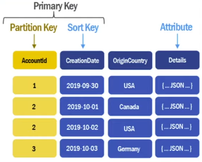

# DynamoDB

## General information ℹ️

**DynamoDB** is a **NoSQL database**. It is not properly a **documental database** as **MongoDB**, it is more of a **Key-Value database**.
- It offers a great availability and durability
- It is ideal for applications that have a known accesibility pattern. That means that you must have pretty clear how to access your data and which is your data access pattern, because you must create a great schema since the beginning

It’s common to have a large item with two distinct sets of attributes: some large, slow-moving attributes combined with small, fast-moving attributes. For example, think of an item representing a video on YouTube. There is a lot of data about the video itself, such as the various resolutions available and their locations, the video description, subtitles, and info cards. This is a lot of information, and it rarely changes.

However, a YouTube video also has a counter displaying the number of views for a video. This is a tiny attribute—a few bits of data—but it might increment thousands of times per day. If you stored this counter on the same item as the video metadata, you might be paying multiple WCUs every time you want to increment the view count.

DynamoDB does not really support many-to-many relationships. I dont know why no one is mentioning that. In dynamo you basically have two paradigms that you can follow when trying to model many to many relationships: 
- You can denormalize your data and make efficient reads but get potentially slow updates and deletes (+ overhead for managing it). 
- You can normalize your data which results in the exact opposite as described above.

## Key concepts 🔑

- **Table:** Collection of items stored inside the database
- **Primary Key:** The unique identifier of each item that is stored inside of the table. In **DynamoDB** it will consist of a **Partition Key** and a **Sort Key**. The **Sort Key** is optional so it is possible that your **Primary Key** will be just the **Partition Key**.
- **Partition Key:** Admits repetead values. The good practice is to choose for the **Partition Key** a field that has low cardinality, that means that the key doesn't allow to group many things by it's value repetition. Try that the groups delimited by each **Partition Key** contains always less than 5% of the total amount of items in all the table.
- **Sort Key:** It is unique for each item. The good practice is to always specify a **Sort Key**, but keep in mind that a **Sort Key** is not always needed. The **Sort Key** allows to do much more queries inside the table than just having a **Partition Key**. If you only have a **Partition Key** then you're limited to do queries that matches the exact same value. e.g. bring me all the items that match this exact **Partition Key** and that's all. Well-designed **Sort Keys** have two key benefits:
	- They gather related information together in one place where it can be queried efficiently. Careful design of the sort key lets you retrieve commonly needed groups of related items using range queries with operators such as `begins_with`, `between`, `>`, `<`, and so on.
	- Composite sort keys let you define hierarchical (one-to-many) relationships in your data that you can query at any level of the hierarchy. For example, in a table listing geographical locations, you might structure the sort key as follows.  `[country]#[region]#[state]#[county]#[city]#[neighborhood]`
- **Global Secondary Index (GSI):** It allows making queries not just by Primary Key but also by other fields.

> In DynamoDB you can choose either you want a **Sort Key** or not, the **Sort Key** is always optional.

Before creating a **DynamoDB** table you should always ask yourself if it's possible that multiple **Partition Keys** are repeated. If this last is the case then you must define a **Sort Key** so the **Partition Key** is able to repeat it self among multiple items.

## Examples

Bellow there are some tables examples that are useful to understand more how to choose the **Partition Key** and the **Sort Key** of a table.

| Table name | Partition Key | Sort Key |
|------------|---------------|----------|
| Movies | Director (e.g Steven "Spielberg") | Release Date (e.g. "2/12/2023") |
| Supermarkets | Supermarket brand (e.g. "Whole Foods") | State, City and Neighborhood (e.g. "NY#Rome#Downtown") |

## Cheat Sheet 📄

To get even more **DynamoDB** details and examples take a look at the [DynamoDB Cheat Sheet](./assets/dynamoDbCheatSheet.pdf) from the **Complete Coding Youtube Channel**

## Other valuable ressources

- [Amazon DynamoDB official developer guide](https://docs.aws.amazon.com/amazondynamodb/latest/developerguide/Introduction.html)
- [Single-table vs. multi-table design in Amazon DynamoDB](https://aws.amazon.com/blogs/database/single-table-vs-multi-table-design-in-amazon-dynamodb/)

## Relevant questions

- [Does DynamoDB charges you when the result of a query is an empty result set?](https://stackoverflow.com/questions/36340138/does-dynamodb-query-that-returns-an-empty-result-set-consume-any-capacity)