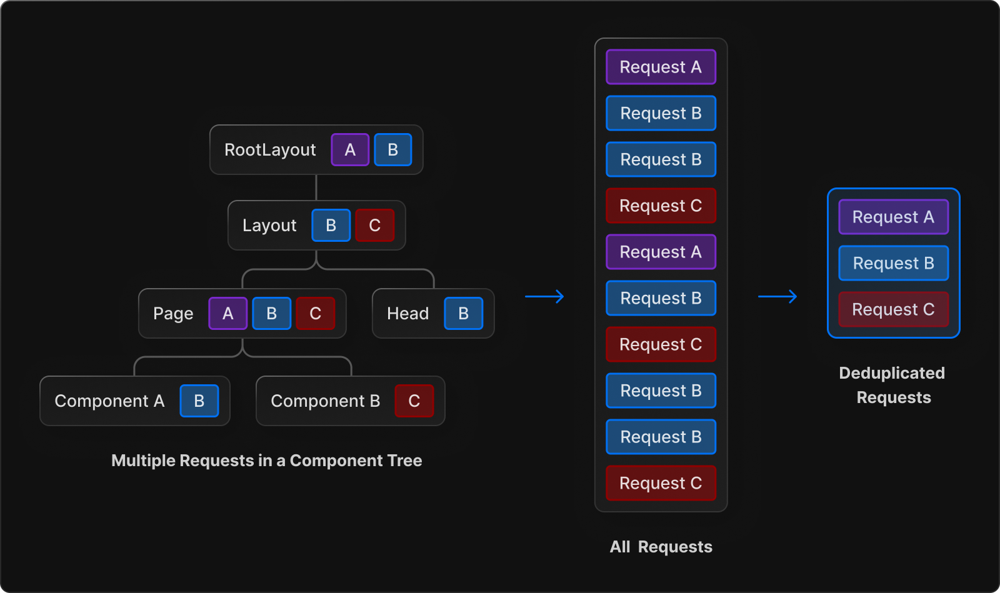

# Data Fetching

In Next.js 13 data fetching works with the native `fetch()` API, Next.js has improved the `fetch()` API just to make the framework better. 

## Fetching data on the server

Don't even think of fetching data from **Client Components**, yes you are able to do it (just like in React), but it is a much better option only fetching from **Server Components**.  

Besides trying to make all the data fetching from **Server Components**, keep in mind that it is also better to do the same request multiple times where you need the response data instead of just making the request one time and pass the response data as props to the children. Passing the response data as props to the children will only make the code more complex and interdependent. Keep in mind that Next.js will cache the responses for every request, so when you make the same request down the component three again the request response is going to be getted from the cache and Next.js will not make the same request again. That's called **Request Deduping**.



> POST, PUT, PATCH, etc. requests are not automatically deduped. Only GET requests, if you want to dedupe those requests that are not GET requests you will need to specify the `next.fetchCache` prop of the options object passed to the `fetch()` to `'force-cache'`
> (e.g.  `await fetch('https://...', { next: { fetchCache: 'force-cache'}});`)

### Data Fetching Patterns

There's 2 data fetching patterns: the **Parallel Data Fetching** and the **Sequential Data Fetching**.

#### Parallel Data Fetching Pattern

The requests that will get the data are going to be sent in parallel resulting in a faster response. The client-server waterfalls are reduced and the time taked to load data is also reduced.

This is how you should do it:

```tsx
import Albums from './albums';

async function getArtist(username) {
  const res = await fetch(`https://api.example.com/artist/${username}`);
  return res.json();
}

async function getArtistAlbums(username) {
  const res = await fetch(`https://api.example.com/artist/${username}/albums`);
  return res.json();
}


export default async function Page({ params: { username } }) {
  // Initiate both requests in parallel
  const artistData = getArtist(username);
  const albumsData = getArtistAlbums(username);

  // Wait for the promises to resolve
  const [artist, albums] = await Promise.all([artistData, albumsData]);

  return (
    <>
      <h1>{artist.name}</h1>
      <Albums list={albums}></Albums>
    </>
  );
}
```

Keep in mind that with this approach the user won't see the rendered result until both promises are resolved. If you want to do both things in parallel but you think one of the request could take less time to complete then you can do the following, where apparently, the artist GET request will take less time, so that's what you're going to expect to end first and then show first:

```tsx
export default async function Page({ params: { username } }) {
  // Initiate both requests in parallel
  const artistData = getArtist(username);
  const albumData = getArtistAlbums(username);

  // Wait for the artist's promise to resolve first
  const artist = await artistData;

  return (
    <>
      <h1>{artist.name}</h1>
      {/* Send the artist information first,
      and wrap albums in a suspense boundary */}
      <Suspense fallback={<div>Loading...</div>}>
        <Albums promise={albumData} />
      </Suspense>
    </>
  );
}

// Albums Component
async function Albums({ promise }) {
  // Wait for the albums promise to resolve
  const albums = await promise;

  return (
    <ul>
      {albums.map((album) => (
        <li key={album.id}>{album.name}</li>
      ))}
    </ul>
  );
}
```

#### Sequential Data Fetching Pattern

This is performed by awaiting the requests that are needed first. Only when request 1 has been sended and a response is received the request 2 is going to be sended, and so on. This pattern is used when the following requests needs something that comes in the response from the previous ones. It is important to only use this pattern if the requests depends on the result of the previous ones.

### How to fetch data

In order to fetch data you only need to use the `fetch()` function with `async` / `await`, just like you do it in React, normally. The only difference is that here there's no problem if you fetch the data directly from the component, without the need of doing it inside a `useEffect()`. That's because requests are deduped by default (excluding POST requests). Also you have to remember that `useEffect()` does not even work inside **Server Components**.

```tsx
async function getData() {
  const res = await fetch('https://api.example.com/...');

  if (!res.ok) {
    // This will activate the closest `error.js` Error Boundary
    throw new Error('Failed to fetch data');
  }

  return res.json();
}

export default async function Page() {
  const data = await getData();

  return <main></main>;
}
```

> If you're using `async` / `await` for **Client Components** with TypeScript, TypeScript could give you an error (this is being fixed by the Next.js team), temporarilly you can use `{/* @ts-expect-error Server Component */}` to disable TypeScript for that section.

Sometimes you don't want to get the cached response of the request, you just want to make the request every time because you need the must updated values every time, for that case you are able either to:
- Specify in the options object passed to the `fetch()` function the prop `next.revalidate` to a n amount of time in seconds, that will revalidate the data, (get the data fresh once again) and re-cache it every n seconds. (e.g. `await fetch('https://...', { next: { revalidate: 10}});`)
- Specify the exact same thing but in a more global level and not at each `fetch()` function call local level. (e.g. at the top of a `layout.js` or `page.js` file write `export const revalidate = 10`. This is going to set that revalidation time for each request made down the three)
- Specify in in the options object passed to the `fetch()` function the prop `cache` to `'no-store'` (e.g. `fetch('https://...', { cache: 'no-store' })`). This is going to prevent data caching in every way, so you're always going to get the fresh data from the back-end.