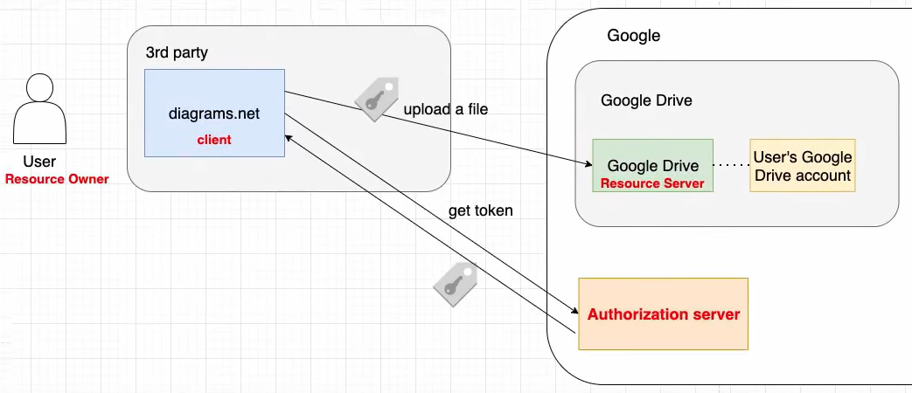
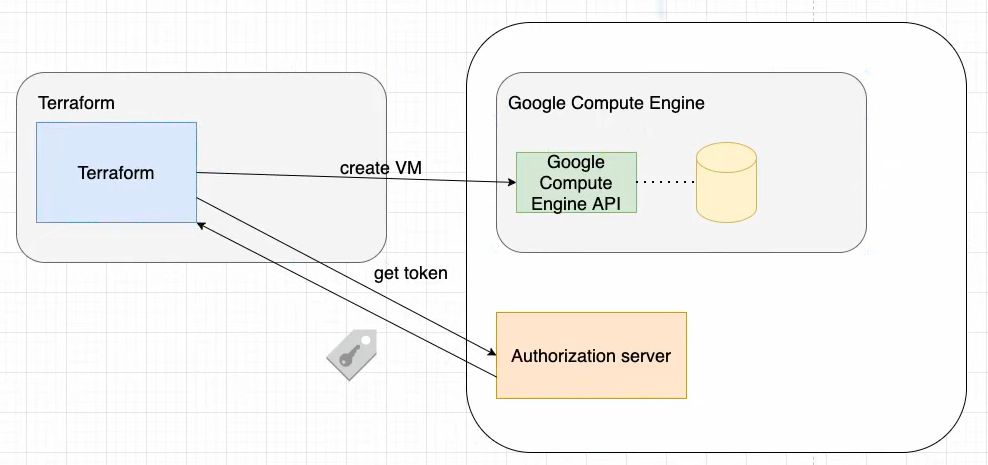

# OAuth

Open Authorization (OAuth) is a popular authorization framework that has 2 use cases.

## Use Case 1: Give a 3rd party limited access to an API on behalf of the user

The user authorizes the 3rd party app to access his data and manage it's content. Let's say that a 3rd party app called MyApp wants to interact with your Youtube Channel content. So MyApp must access to the Youtube API. In order to do so, the user of MyApp needs to authorize that a third party app is able to view it's private data, upload, remove and edit videos from it's Youtube channel from some other place (MyApp) different than the Youtube App itself. Keep in mind that as Youtube allows to do this, this applies to many other kind of businesses, where the app A from company A is trying to interact with the data of an app B, from company B.

All the companies that plays the role of the company B must have something called an **Authorization Server**. The **Authorization Server** provides JWT tokens that are used to access the app B data.

## Use Case 2: Give a 3rd party access to API on behalf of itself (service account)

## Workflow with OAuth that applies for every API integration

When you create an OAuth app you need to register it inside your service provider. You must follow the next steps:

1. When creating the application (web app, mobile app, etc.) you must register it inside the developer console:
	* Register redirect URIs
	* Upload logo
	* Add description
	* get Client Id (identifier of the application)
	* get Client Secret (Only if you have a confidential client)
2. Make some basis code, sufficient to provide a screen or a page where the user is able to begin the OAuth authorization grant process.
3. Whenever the user is inside that screen or page, the user is going to be redirected to the company B **Authorization Server** by opening the link to the **Authorization Server** page with the browser. The opened link is an uri that's always allowed to has the following **Query Parameters**:
	* redirect_uri
	* client_id
	* scope
	* state
	* code_challenge (PKCE)
	* code_challenge_method PKCE
4. The user needs to complete the form displayed by the company B **Authentication Server** page, were he will approve the permissions that are being requested to accept. 

> Keep in mind that the redirection will fail if the **redirect_uri** provided when opening the link is not registered inside the service provider developer console (e.g Google Cloud Platform, Amazon Web Services, Microsoft Azure, etc.)

5. After the user completes the form, then the company B **Authorization Server** page is going to redirect the user to the uri provided by the **redirect_uri** Query Param, this is going to be in the vast majority of cases an uri that points to your app (An URI that instead of having https as the prefix, it has some kind of personalized prefix specified by you when developing the app). This needs to be handled by Deep Linking inside your app. Your app needs to identify when some other app is trying to open your app. The URI identified by your app will have a Query Param named the **code**. 
6. Inside your code base you need to grab that **code** and exchange it for an access token provided by your service provider by making a request.

